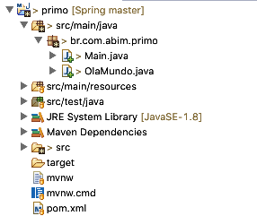

# Spring Framework

## Criando um projeto Maven no Eclipse para usar o Spring

Primeiro vamos criar um projeto maven no eclipse. 

A hierarquia do projeto de demonstração é semelhante à mostrada na Figura 1.

<p align="center">
  
</p>
<p align="center">
   <strong>Figura 1- Estrutura do projeto spring</strong> 
</p>

::: :walking: Passo a passo :::  

1. Crie uma pasta GrupoDeEstudo/Spring

2. Abra o Eclipse 

2. Execute "Switch Workspace" para a pasta GrupoDeEstudo/Spring e crie um projeto Maven: File|New|Other|Maven Project

3. Crie um projeto simples (sem usar um arquétipo). 

4. Preencha os campos com:
```
groupId    : br.com.abim
artifactId : primo
version    : 0.1.0-SNAPSHOT
packaging  : jar
```
4. Altere o arquivo `pom.xml` conforme abaixo:

```xml
<?xml version="1.0" encoding="UTF-8"?>
<project xmlns="http://maven.apache.org/POM/4.0.0" xmlns:xsi="http://www.w3.org/2001/XMLSchema-instance"
	xsi:schemaLocation="http://maven.apache.org/POM/4.0.0 http://maven.apache.org/xsd/maven-4.0.0.xsd">
	<modelVersion>4.0.0</modelVersion>

	<groupId>br.com.abim</groupId>
	<artifactId>primo</artifactId>
	<version>0.0.1-SNAPSHOT</version>
	<packaging>jar</packaging>

	<name>primo</name>
	<description>Demo project for Spring Boot</description>

	<parent>
		<groupId>org.springframework.boot</groupId>
		<artifactId>spring-boot-starter-parent</artifactId>
		<version>2.1.0.RELEASE</version>
		<relativePath/> <!-- lookup parent from repository -->
	</parent>

	<properties>
		<project.build.sourceEncoding>UTF-8</project.build.sourceEncoding>
		<project.reporting.outputEncoding>UTF-8</project.reporting.outputEncoding>
		<java.version>1.8</java.version>
	</properties>

	<dependencies>
		<dependency>
			<groupId>org.springframework.boot</groupId>
			<artifactId>spring-boot-starter</artifactId>
		</dependency>

		<dependency>
			<groupId>org.springframework.boot</groupId>
			<artifactId>spring-boot-starter-test</artifactId>
			<scope>test</scope>
		</dependency>
	</dependencies>

	<build>
		<plugins>
			<plugin>
				<groupId>org.springframework.boot</groupId>
				<artifactId>spring-boot-maven-plugin</artifactId>
			</plugin>
		</plugins>
	</build>


</project>
```
<p align="center">
   <strong>Listagem 1- arquivo pom.xml</strong> 
</p>

::: :pushpin: Importante :::

> Preste atenção nas configurações abaixo:

```Xml
	<parent>
		<groupId>org.springframework.boot</groupId>
		<artifactId>spring-boot-starter-parent</artifactId>
		<version>2.1.0.RELEASE</version>
		<relativePath/> <!-- lookup parent from repository -->
	</parent>
```
> Você está informando ao Maven que esse projeto tem como `parent` o projeto `spring-boot-starter-parent`. Isso faz com que todas as configurações que já foram feitas nesse "projeto pai" sejam aproveitadas nesse nosso projeto. 


e também no seguinte trecho

```xml
	<dependencies>
		<dependency>
			<groupId>org.springframework.boot</groupId>
			<artifactId>spring-boot-starter</artifactId>
		</dependency>

		<dependency>
			<groupId>org.springframework.boot</groupId>
			<artifactId>spring-boot-starter-test</artifactId>
			<scope>test</scope>
		</dependency>
	</dependencies>
```
> Você está informando ao Maven as duas dependências necessárias para os projetos SpringBoot. 

5. Crie uma nova classe no pacote `br.com.abim.primo` denominada `OlaMundo.java`

```java
package br.com.abim.primo;

import org.springframework.stereotype.Component;

@Component
public class OlaMundo {

    public void digaOla(){
        System.out.println("Olá Mundo. Eu sou um bean do Spring");
    }
}
```
<p align="center">
   <strong>Listagem 2- OlaMundo.java </strong> 
</p>

::: :pushpin: Importante :::
> Preste atenção no trecho de código abaixo:

```java 
@Component
public class OlaMundo {
...
```
> Você está usando uma anotação de classe que transforma essa classe em um componente do Spring


| Anotação      | Significado   											     | 
| ------------- |:----------------------------------------------------------------------------------------------------------| 
| @Component    |Anotação genérica para qualquer componente gerenciado pelo Spring. Esta anotação faz com que o bean  registrado no Spring possa ser utilizado em qualquer bean, seja ele um serviço, um DAO, um controller, etc. No nosso exemplo, ele será responsável por um Bean que representa uma entidade. | 
| @Repository   |Anotação que serve para definir uma classe como pertencente à camada de persistência.      | 
| @Service      |Anotação que serve para definir uma classe como pertencente à camada de Serviço da aplicação.     | 
| @Autowired    |A anotação @ Autowired fornece controle sobre onde e como a ligação entre os beans deve ser realizada. Pode ser usado para em métodos setter, no construtor, em uma propriedade ou métodos com nomes arbitrários e / ou vários argumentos.| 
<p align="center">
   <strong>Tabela 1- Principais anotações do Spring </strong> 
</p>

6. Nesse mesmo pacote, crie outra classe `Main.java` com o seguinte conteúdo:

```java
package br.com.abim.primo;

import org.springframework.boot.SpringApplication;
import org.springframework.boot.autoconfigure.SpringBootApplication;
import org.springframework.context.ApplicationContext;

import br.com.abim.primo.OlaMundo;


@SpringBootApplication
public class Main {

	public static void main(String[] args) {
		ApplicationContext ctx = SpringApplication.run(Main.class, args);
		OlaMundo olaMundo = (OlaMundo) ctx.getBean("olaMundo");
		olaMundo.digaOla();
	}
}
```
<p align="center">
   <strong>Listagem 3- Main.java </strong> 
</p>


7. Execute a aplicação via eclipse

#### Desafio 1 :innocent:
 
```
- Execute a aplicação via prompt de comando usando 
```
`mvn package`
e depois 
`java -jar target/primo-0.0.1-SNAPSHOT.jar` 


> Algum teste unitário foi executado?

#### Desafio 2 :innocent:
 
```
- Altere a classe `PrimoApplicationTests` para que fique conforme a listagem 4
```

```java
package br.com.abim.primo;

import static org.junit.Assert.assertNotNull;

import org.junit.Test;
import org.junit.runner.RunWith;
import org.springframework.boot.SpringApplication;
import org.springframework.boot.test.context.SpringBootTest;
import org.springframework.context.ApplicationContext;
import org.springframework.test.context.junit4.SpringRunner;

@RunWith(SpringRunner.class)
@SpringBootTest
public class PrimoApplicationTests {

	@Test
	public void contextLoads() {
		ApplicationContext ctx = SpringApplication.run(Main.class);
		assertNotNull(ctx);
	}

}

```
<p align="center">
   <strong>Listagem 4- PrimoApplicationTests.java </strong> 
</p>

```
- Execute o teste unitário via Eclipse 
```


